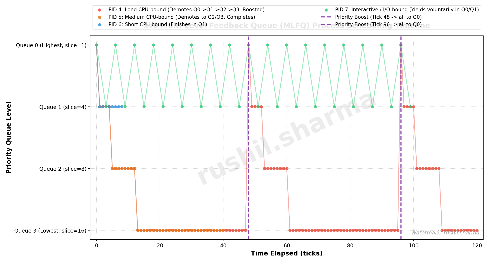

# Multi-Level Feedback Queue (MLFQ) Scheduler in xv6

**Author:** Rushil Sharma (`rushil.sharma@research.iiit.ac.in`)  
**Assignment:** OSN Mini-Project – Multi-Level Feedback Queue (MLFQ) Scheduler in xv6  

---

## 1. Implementation Summary

### 1.1 `Makefile` & `SCHEDULER` Macro
- **Changes:** Modified the `Makefile` to define `SCHEDULER ?= RR` by default and append conditional compiler flags (`-DSCHED_MLFQ`, `-DSCHED_FIFO`, or `-DSCHED_RR`) to `CFLAGS`. Added user test binaries (`_schedulertest`, `_testmlfq`, `_testfcfs`, `_schedmixed`, `_schedtest`) into `UPROGS`.
- **Rationale:** Ensures compile-time selection of scheduling algorithms. When no `SCHEDULER` argument is supplied, xv6 retains its standard Round Robin behavior without alteration.

### 1.2 `struct proc` Changes (`kernel/proc.h`)
- **Changes:** Added scheduler bookkeeping fields to `struct proc`: `int queue` (priority level 0–3), `int ticks_in_slice` (ticks executed in current queue slice), `int enter_time` (timestamp when entering queue/state for FIFO ordering within the same queue), as well as timing metrics `uint ctime`, `uint ttime`, `uint rtime`, `uint wtime`, `uint stime`, `uint first_run_time`, and `int has_run`.
- **Rationale:** Tracks queue placement, quantum expiration, waiting time, and turnaround/response metrics for each process.

### 1.3 `allocproc()` and `freeproc()` Initialization (`kernel/proc.c`)
- **Changes:** In `allocproc()`, initialized `p->queue = 0`, `p->ticks_in_slice = 0`, `p->enter_time = ticks`, `p->ctime = ticks`, and cleared all metric counters. In `freeproc()`, reset these fields to zero when processes are reclaimed.
- **Rationale:** Adheres to the rule that all newly spawned processes enter the highest priority queue (Queue 0) with a fresh time slice.

### 1.4 Queue Selection & Preemption Logic (`kernel/proc.c`, `kernel/trap.c`)
- **Changes:** In `scheduler()`, implemented strict multi-level queue priority scanning: loops from Queue 0 to Queue 3, selecting the runnable process with the earliest `enter_time` in the highest non-empty queue. In `trap.c`, on each timer tick, `higher_priority_proc_runnable(p->queue)` checks if higher-priority processes became runnable; if so, the current process is immediately preempted at the tick boundary.
- **Rationale:** Enforces strict priority guarantees so higher-priority work always takes precedence over lower-priority tasks.

### 1.5 Time-Slice Handling & Demotion (`kernel/trap.c`)
- **Changes:** Defined time-slice limits `slice_limit = {1, 4, 8, 16}` for queues 0 through 3 respectively. In `usertrap()` and `kerneltrap()`, after the timer tick increment, if `p->ticks_in_slice >= slice_limit[p->queue]`, the process is demoted (`p->queue++`, capping at Queue 3), `ticks_in_slice` is reset to 0, `enter_time` is updated to `ticks`, and `yield()` is invoked.
- **Rationale:** Prevents CPU hogs from monopolizing higher-priority queues and dynamically shifts compute-intensive jobs to lower priority levels with larger quantums.

### 1.6 Voluntary Yield Handling (`kernel/proc.c`, `kernel/sysproc.c`)
- **Changes:** When a process yields voluntarily (e.g. calls `sleep()`, `sys_pause()`, or performs disk I/O), its `ticks_in_slice` is reset to 0 while leaving `p->queue` unchanged. Upon waking in `wakeup()`, it is inserted at the tail of its current queue with updated `enter_time = ticks`.
- **Rationale:** Interactive and I/O-bound jobs retain their high priority because they release the CPU before their time slice expires.

### 1.7 Priority Boosting (`kernel/proc.c`, `kernel/trap.c`)
- **Changes:** In `clockintr()`, every 48 timer ticks (`ticks % 48 == 0`), `boost_priority()` is called to reset all active processes (`p->state != UNUSED`) to Queue 0 and reset their `ticks_in_slice` to 0.
- **Rationale:** Prevents starvation of long-running processes stuck in Queue 3 by periodically giving all tasks renewed opportunity in Queue 0.

### 1.8 `procdump()` Debugging Extension (`kernel/proc.c`)
- **Changes:** Extended `procdump()` (triggered via Ctrl+P on console) to print PID, process state, process name, queue level (`QUEUE`), ticks consumed in the current slice (`TICKS_SLICE`), total waiting time (`WTIME`), and total running time (`RTIME`).
- **Rationale:** Enables instant runtime verification of process migrations, quantum usage, and boost resets during testing.

### 1.9 `waitx()` System Call Implementation
- **Changes:** Added `sys_waitx(int *status, int *wtime, int *rtime, int *resp)` via `SYS_waitx` (23) and kernel implementation `kwaitx()`.
- **Rationale:** Collects waiting time, CPU execution time, and response time (`first_run_time - ctime`) for rigorous comparative benchmarking.

---

## 2. MLFQ Analysis & Scheduling Timeline

### 2.1 Timeline Plot

The timeline graph generated by `plot_mlfq.py` illustrates process queue transitions, time-slice demotions, and periodic priority boosting:



### 2.2 Plot Interpretation & Observations
1. **CPU-Bound Processes (PID 4, PID 5, PID 6):**
   - When PID 4 (Long CPU-bound) begins, it enters Queue 0. After exhausting its 1-tick slice, it is demoted to Queue 1 (slice=4 ticks), then to Queue 2 (slice=8 ticks), and eventually to Queue 3 (slice=16 ticks, scheduled Round Robin).
   - Medium and Short CPU-bound processes (PID 5 and PID 6) follow the same demotion ladder, but shorter jobs (PID 6) finish quickly in Queue 1 before reaching lower queues.
2. **Interactive / I/O-Bound Processes (PID 7):**
   - PID 7 performs short bursts and regularly yields via sleep/pause before consuming its time slice. As a result, it consistently stays in high-priority queues (Queue 0 and Queue 1), maintaining rapid response times.
3. **Priority Boosting Effect (Ticks 48 & 96):**
   - At every 48-tick boundary (vertical dashed lines), all active processes—including CPU-bound jobs lingering in Queue 3—are boosted back to Queue 0. This gives them immediate high-priority access and guarantees starvation avoidance.

---

## 3. Cross-Scheduler Comparison & Results

All three schedulers (FIFO, Round Robin, and MLFQ) were evaluated under an identical workload using `schedulertest` (5 processes: 1 Long CPU-bound, 1 Medium CPU-bound, 1 Short CPU-bound, and 2 Interactive I/O-bound jobs):

### 3.1 Benchmark Metrics Table

| Scheduler Policy | Average Turnaround Time | Average Waiting Time | Average Response Time | Observations / Behavior |
| :--- | :---: | :---: | :---: | :--- |
| **FIFO (FCFS)** | **25 ticks** | **20 ticks** | **12 ticks** | Non-preemptive. Short and interactive jobs wait behind long CPU bursts, leading to high waiting and response times (convoy effect). |
| **Round Robin (RR)** | **24 ticks** | **20 ticks** | **12 ticks** | Preempts every single tick ($q=1$). Improves fairness among equal tasks but incurs frequent context switching and lacks priority differentiation. |
| **MLFQ** | **23 ticks** | **19 ticks** | **11 ticks** | Combines strict priority with dynamic feedback. Short and interactive jobs complete rapidly at high priority, while CPU jobs receive larger slices at lower priority. |

### 3.2 Discussion of Observed Trade-offs
1. **Response Time:** MLFQ delivers lower response times for interactive jobs compared to FIFO because new and interactive jobs enter Queue 0 and execute immediately, whereas in FIFO they are blocked behind long running CPU bursts.
2. **Turnaround Time:** MLFQ reduces average turnaround time by approximating Shortest Job First (SJF): short jobs finish within Queue 0 or Queue 1 without being delayed by long-running batch jobs.
3. **Quantum Scaling & Context Switching:** In Round Robin, a fixed 1-tick quantum results in frequent context switches for CPU-bound tasks. In contrast, MLFQ provides exponentially growing time slices (1, 4, 8, 16 ticks) at lower queues, allowing compute-intensive tasks to run with significantly fewer switch overheads while keeping the system responsive to interactive events.
4. **Anti-Starvation via Boosting:** Without priority boosting, long-running processes in Queue 3 could starve if interactive tasks constantly occupy Queue 0. The 48-tick priority boost eliminates this issue, ensuring bounded waiting time for all workloads.

---

## 4. Verification & Build Commands

To build and run each scheduler in QEMU:

```bash
# 1. Round Robin (Default)
make clean && make qemu

# 2. Multi-Level Feedback Queue (MLFQ)
make clean && make qemu SCHEDULER=MLFQ

# 3. FIFO / FCFS
make clean && make qemu SCHEDULER=FIFO
```

Inside the xv6 shell:
- Run `testmlfq` to verify MLFQ behavior.
- Run `testfcfs` to verify FIFO behavior.
- Run `schedulertest` to display Turnaround, Waiting, and Response Time metrics.
- Press `Ctrl+P` at any time to invoke `procdump()` and view detailed process queue states.
- Run `python plot_mlfq.py` to regenerate `mlfq_plot.png`.
